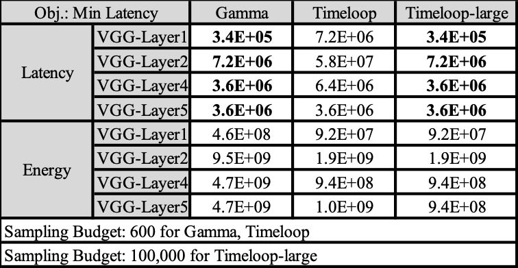

# Gamma-Timeloop v.s. Timeloop's search algorithm
We provide an example script to execute experiments for contrasting the quality of the found solution by Gamma-Timeloop and Timeloop's native search algorithm.
```
sh run_exp.sh
```

### An Example Experiment
In this experiment,
* We use latency as the first-ordered objective and energy as the second-ordered objective.
* We use the HW resource configuration as follows:
  * num_pe=256, l1_size=100, l2_size=8192
* We use four of the VGG16 layers as target layers
* We set sampling budget as 600 data points for both Gamma-Timeloop and Timeloop.
  * To evaluate the quality of found solution by Gamma-Timeloop, we form another Timeloop configuration --- Timeloop-large.
  * Timeloop-large has sampling budget of 100,000 points. It represents a potential solution if using more exhaustively searched strategy.


#####The example comparison results of this experiment:
